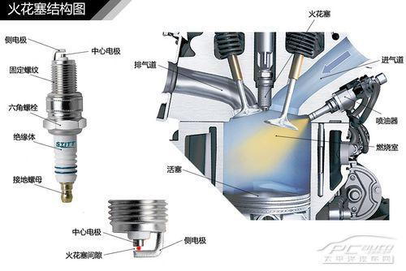
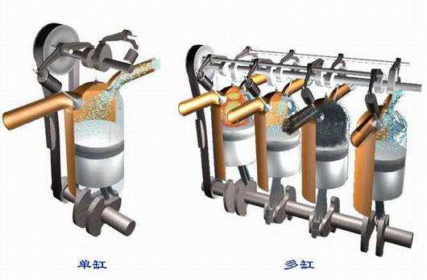
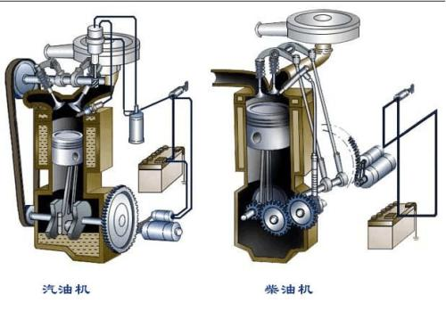
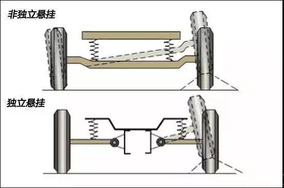

 # 购车知识扫盲
- [非技术知识](#非技术知识)
    - [中国汽车集团（相关信息以官网公示为准）](#中国汽车集团相关信息以官网公示为准)
        - [1、一汽集团](#1一汽集团四大之一)
        - [2、东风汽车](#2东风汽车四大之一)
        - [3、长安集团](#3长安集团四大之一)
        - [4、上汽集团](#4上汽集团四大之一)
        - [5、北汽集团](#5北汽集团)
        - [6、广汽集团](#6广汽集团)
        - [7、奇瑞汽车](#7奇瑞汽车)
        - [8、吉利汽车](#8吉利汽车)
        - [9、比亚迪汽车](#9比亚迪汽车)
        - [10、长城汽车](#10长城汽车)
    - [常见问题](#常见问题)
        - [购车流程](#购车流程)
        - [购车价格、税费以及保险](#购车价格税费以及保险)
        - [贴牌车](#贴牌车)
        - [其它](#其它)
- [技术知识](#技术知识)
    - [发动机](#发动机)
    - [变速箱](#变速箱)
    - [底盘悬挂系统](#底盘悬挂系统)
    - [轮胎](#轮胎)
- [购买注意事项](#购买注意事项)

## 非技术知识
### 中国汽车集团（相关信息以官网公示为准）

#### 1、一汽集团（四大之一）
```
全称：中国第一汽车集团有限公司
性质：国有独资（国务院）
位置：吉林省长春市东风大街8899号

子公司：中国第一汽车股份有限公司  等等
自主品牌：红旗、奔腾、夏利、解放
合资品牌：大众、丰田
```
一汽集团工商信息：

#### 2、东风汽车（四大之一）
```
全称：东风汽车集团有限公司
性质：国有独资（国务院）
位置：湖北省武汉市（前身是第二汽车制造厂）

子公司：东风汽车有限公司（中日合资），东风汽车股份有限公司（东风汽车有限公司发起，社会募资的新公司）
自主品牌：东风风行、东风风度、东风小康、东风启辰、东风风神、东风风光等
合资品牌：雪铁龙、标志、英菲尼迪、本田等
```
东风集团工商信息：

#### 3、长安集团（四大之一）
```
全称：中国长安汽车集团股份有限公司
位置：北京市
性质：股份所有制（中国南方工业集团公司全资控股（国务院））

子公司：
自主品牌：长安汽车、哈飞汽车、江铃汽车、江滨活塞、建安车轿
合资品牌：
```
长安集团工商信息：

中国南方工业集团公司工商信息：

#### 4、上汽集团（四大之一）
```
全称：上海汽车工业（集团）总公司
位置：上海市
性质：全民所有制（上海市国有资产管理委员会）

子公司：上海汽车集团股份有限公司
自主品牌：五菱、别克、凯迪拉克、雪弗兰、大众、斯科达、大通、荣威MG等
合资品牌：
```
上汽集团工商信息：

上海汽车集团股份有限公司工商信息：

#### 5、北汽集团
```
全称：北京汽车集团有限公司
位置：北京市
性质：有限责任公司(国有独资)

子公司： 北京汽车股份有限公司（中外合资） 等等
自主品牌：背景、绅宝、昌河、福田等
合资品牌：奔驰、现代等
```
北汽集团工商信息：

#### 6、广汽集团
```
全称：广州汽车工业集团有限公司
位置：广东省广州市
性质：有限责任公司(国有独资)	

子公司：广州汽车集团股份有限公司 等等
自主品牌：广汽传祺
合资品牌：广汽本田、广汽丰田、广汽菲亚特克莱斯勒等
```
广汽集团工商信息：

#### 7、奇瑞汽车
```
全称：奇瑞汽车股份有限公司
位置：安徽省芜湖市
性质：股份有限公司(非上市、国有控股)

自主品牌：
合资品牌：
```
奇瑞汽车工商信息：

#### 8、吉利汽车
```
全称：浙江省吉利控股集团有限公司
位置：浙江杭州
性质：有限责任公司(自然人投资或控股)
自主品牌：
合资品牌：
```
吉利汽车工商信息：

#### 9、比亚迪汽车
```
全称：比亚迪股份有限公司
位置：广东深圳
性质：股份有限公司(台港澳与境内合资、上市)
自主品牌：
合资品牌：
```
比亚迪汽车工商信息：

#### 10、长城汽车
```
全称：长城汽车股份有限公司
位置：河北保定
性质：股份有限公司(台港澳与境内合资、上市)
自主品牌：
合资品牌：
```
长城汽车工商信息：


[工商信息查询网站](https://www.qixin.com/)
### 常见问题
#### 购车流程
```
```
#### 购车价格、税费以及保险
* `指导价`：汽车厂商根据生产成本和预估市场确定的销售价格。受汽车`厂商优惠`影响
* `裸车价`：4s店根据实际市场确定的销售价格，受`4s店优惠`和`厂商优惠`的影响
* `落地价`：可以合法上路的最终成交价格，包括`裸车价`+`购置税`+`保险`+`牌照`，受`购置税减免`等税收优惠政策的影响
* `关于税费`
<table>
    <thead>
        <tr>
            <td></td>
            <td>购置税</td>
            <td>车船税</td>
        </tr>
    </thead>
    <tbody>
        <tr>
            <td>定义</td>
            <td>对在境内购置规定车辆的单位和个人征收的一种税</td>
            <td>以车船为征收对象，向车辆、船舶的所有人或者管理者征收的一种税。</td>
        </tr>
        <tr>
            <td>缴费时间</td>
            <td>购车时一次性缴纳，税率10%</td>
            <td>交强险时征收，有税表，其中1.6-2.0L排量，交360-660元税费</td>
        </tr>
    </tbody>
</table>

* `关于保险`
```
交强险（全称：机动车辆交通事故责任强制保险）`：这个保险主要用于赔付第三方，而不是车主自己，且是必须要买的，新车1000以内。

车损险：是指被保险人或其允许的驾驶员在驾驶保险车辆时发生保险事故而造成保险车辆受损，保险公司在合理范围内予以赔偿的一种汽车商业保险

不计免赔（不计免赔率特约条款）：所谓不计免赔特约险，即是指车险中的不计免赔特约条款，它属于商业附加险的一种。该险种通常是指经特别约定，保险事故发生后，按照对应投保的主险条款规定的免赔率计算的、应当由被保险人自行承担的免赔额部分，保险人负责赔偿的一种保险。投保后，车主不仅可以享受到按保险条款，应由保险公司承担的那一部分赔偿；还可享受到由于车主在事故中负有责任，而应自行承担的那部分金额赔偿。按照保险对象的不同，不计免赔险又可分为基本险的不计免赔和附加险的不计免赔，车主在投保时应详细了解。

第三者责任保险：对交强险的赔偿能力的补充

车上人员险：车上人员责任险，即车上座位险，是即车上人员责任险中的乘客部分，指的是被保险人允许的合格驾驶员在使用保险车辆过程中发生保险事故，致使车内乘客人身伤亡，依法应由被保险人承担的赔偿责任，保险公司会按照保险合同进行赔偿

盗抢险：

玻璃险：即保险公司负责赔偿保险车辆在使用过程中，发生本车玻璃破碎的损失的一种商业保险。玻璃破碎，是指被保车辆只有挡风玻璃和车窗玻璃（不包括车灯、车镜玻璃）出现破损的情况。

车身划痕险：

自燃险：

全险：事实上不存在所谓的全险，只是新车销售把几种车险合在一起，便于称呼和捆绑销售。主要包括交强险+车损险+第三者责任保险+不计免赔+车上人员险
```
`注：各种保险的赔付标准要以保险合同为准`
#### 贴牌车
```
```
#### 其它
```
```
## 技术知识

### 发动机
* `内燃机：`是将液体或气体燃料与空气混合后，直接输入机器内部燃烧产生热能再转化为机械能的一种热机。是发动机的一大类。
* `发动机：`发动机就是通过能量的转换，变为动能，为其他的零件提供动能。除了内燃机，还有外燃机（包含蒸汽机、斯特林发动机）、透平机（涡轮风扇发动机）、喷气发动机等等，都属于发动机范畴。

* 常见的汽车内燃机分类
```
1、按燃料不同分类
    汽油内燃机
    柴油内燃机
    特种燃料（醇类、天然气等）内燃机
2、按气缸数分类
    单缸
    多缸：3、4、5、6、8、10、12、18缸
    多缸按气缸排列方式分：直列、V型、W型的
3、按冷却方式分：
    风冷式
    水冷式
```
* `火花塞示意图`

* `单杠和多缸示意图`

* `汽油机和柴油机简图`

* `汽车发动机提高热效率的技术`
[发动机技术点](https://www.sohu.com/a/212426783_372591)

`注：`国产的发动机和合资发动机最大的差距还是在稳定性，耐久性和实际体验上。长安的蓝鲸发动机，现在出现了机油增多和乳化问题，长城的1.5T油耗问题也饱受吐槽，吉利和传祺的倒是没有出过什么问题，但是数据上就比较平庸了。

### 变速箱
```
```
### 底盘悬挂系统
* `定义：`底盘悬挂系统是汽车的车架与车桥或车轮之间的一切传力连接装置的总称，悬架的主要作用是传递作用在车轮和车身之间的一切力和力矩，比如支撑力、制动力和驱动力等，并且缓和由不平路面传给车身的冲击载荷、衰减由此引起的振动、保证乘员的舒适性、减小货物和车辆本身的动载荷。
* `根据结构不同分类`
```
1、独立悬挂底盘系统：因此从使用过程来看，当一侧车轮受到冲击、振动后可通过弹性元件自身吸收冲击力，这种冲击力不会波及另一侧车轮，使得厂家可在车型的设计之初通过适当的调校使汽车在乘坐舒适性、稳定性、操纵稳定性三方面取得合理的配置。选用独立悬挂汽车一般来说其操控性和舒适性均要明显好于选用非独立悬挂的汽车。
2、非独立悬挂底盘系统：由于是用一根杆件直接刚性地连接在两侧车轮上，一侧车轮受到的冲击、振动必然要影响另一侧车轮，这样自然不会得到较好的操纵稳定性及舒适性，同时由于左右两侧车轮的互相影响，也容易影响车身的稳定性，在转向的时候较易发生侧翻
```

* `常见的底盘悬挂系统`
```
1、麦弗逊式悬挂系统
2、双叉臂式独立悬架
3、扭力梁式半独立悬架
4、多连杆式独立悬架
```
[更多参考资料](https://baijiahao.baidu.com/s?id=1609942593325933078&wfr=spider&for=pc)

`注：`现在的家用汽车，前轮都为独立悬架，中高端车型的后悬架一般为独立悬架，低端车型或者小车后轮通常用非独立悬架，下面我们来看看常见的悬架系统，它们都有什么特性
[referer](https://www.sohu.com/a/154943959_99942089)

### 轮胎
* `技术指标`
```
```

## 购买注意事项