 # 购车知识扫盲
- [非技术知识](#非技术知识)
    - [中国汽车集团（相关信息以官网公示为准）](#中国汽车集团（相关信息以官网公示为准）)
        - [1、一汽集团（四大之一）](#1、一汽集团（四大之一）)
        - [2、东风汽车（四大之一）](#2、东风汽车（四大之一)
        - [3、长安集团（四大之一）](#3、长安集团（四大之一）)
        - [4、上汽集团（四大之一）](#4、上汽集团（四大之一）)
        - [5、北汽集团](#5、北汽集团)
        - [6、广汽集团](#6、广汽集团)
        - [7、奇瑞汽车](#7、奇瑞汽车)
        - [8、吉利汽车](#8、吉利汽车)
        - [9、比亚迪汽车](#9、比亚迪汽车)
        - [10、长城汽车](#10、长城汽车)
    - [常见问题](#常见问题)
        - [购车流程](#购车流程)
        - [购车税费以及保险](#购车税费以及保险)
        - [贴牌车](#贴牌车)
        - [其它](#其它)
- [技术知识](#技术知识)
    - [发动机](#发动机)
    - [变速箱](#变速箱)
    - [底盘系统](#底盘系统)
- [购买注意事项](#购买注意事项)

## 非技术知识
### 中国大汽车集团（相关信息以官网公示为准）

#### 1.一汽集团（四大之一）
```
全称：中国第一汽车集团有限公司
性质：国有独资（国务院）
位置：吉林省长春市东风大街8899号

子公司：中国第一汽车股份有限公司  等等
自主品牌：红旗、奔腾、夏利、解放
合资品牌：大众、丰田
```
一汽集团工商信息：
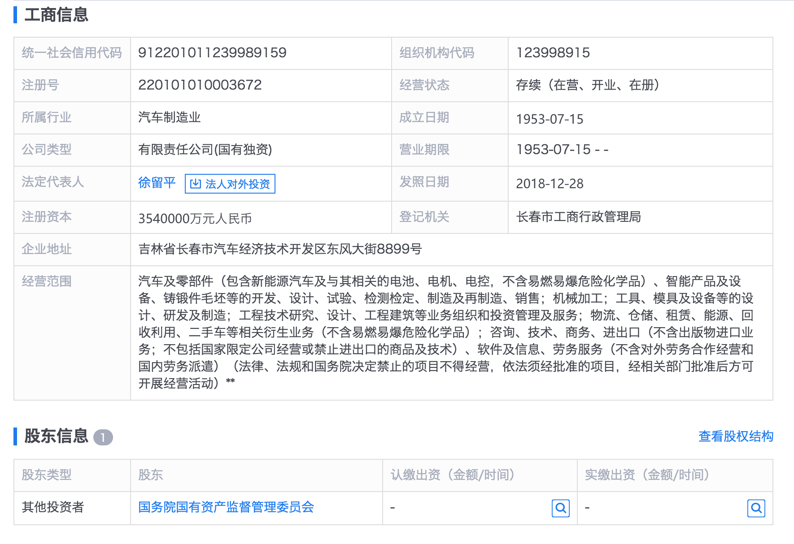
#### 2、东风汽车（四大之一）
```
全称：东风汽车集团有限公司
性质：国有独资（国务院）
位置：湖北省武汉市（前身是第二汽车制造厂）

子公司：东风汽车有限公司（中日合资），东风汽车股份有限公司（东风汽车有限公司发起，社会募资的新公司）
自主品牌：东风风行、东风风度、东风小康、东风启辰、东风风神、东风风光等
合资品牌：雪铁龙、标志、英菲尼迪、本田等
```
东风集团工商信息：
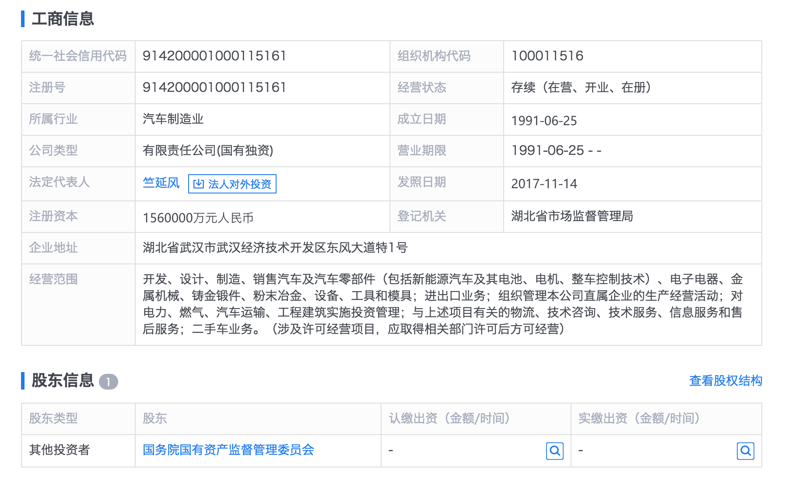
#### 3、长安集团（四大之一）
```
全称：中国长安汽车集团股份有限公司
位置：北京市
性质：股份所有制（中国南方工业集团公司全资控股（国务院））

子公司：
自主品牌：长安汽车、哈飞汽车、江铃汽车、江滨活塞、建安车轿
合资品牌：
```
长安集团工商信息：
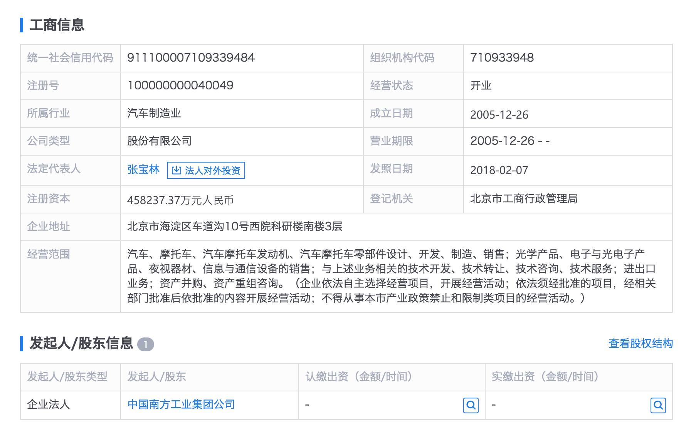
中国南方工业集团公司工商信息：
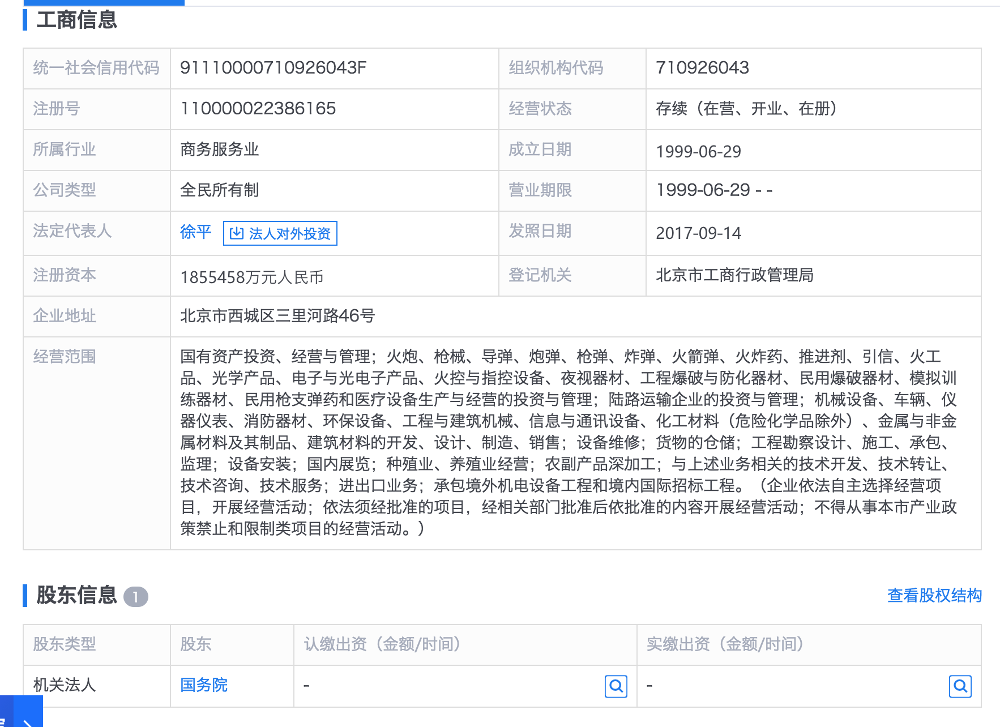
#### 4、上汽集团（四大之一）
```
全称：上海汽车工业（集团）总公司
位置：上海市
性质：全民所有制（上海市国有资产管理委员会）

子公司：上海汽车集团股份有限公司
自主品牌：五菱、别克、凯迪拉克、雪弗兰、大众、斯科达、大通、荣威MG等
合资品牌：
```
上汽集团工商信息：
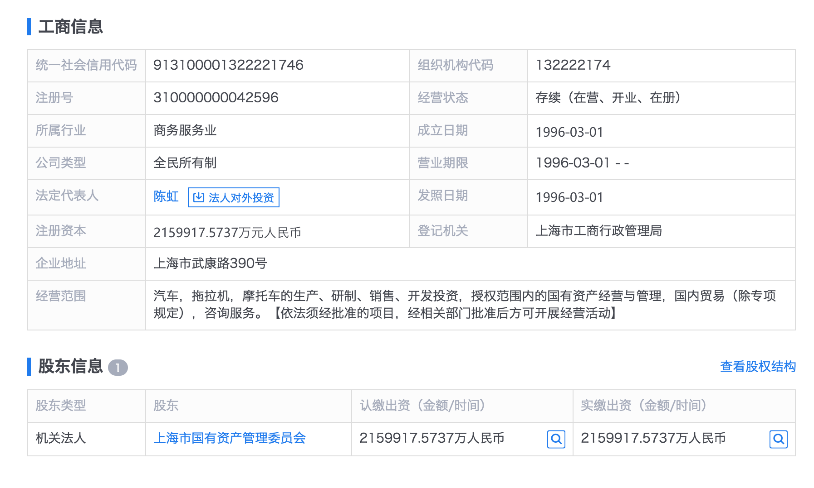
上海汽车集团股份有限公司工商信息：
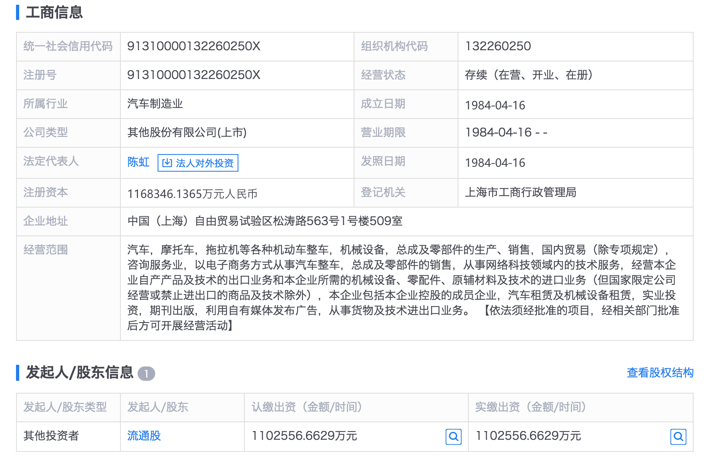
#### 5、北汽集团
```
全称：北京汽车集团有限公司
位置：北京市
性质：有限责任公司(国有独资)

子公司： 北京汽车股份有限公司（中外合资） 等等
自主品牌：背景、绅宝、昌河、福田等
合资品牌：奔驰、现代等
```
北汽集团工商信息：
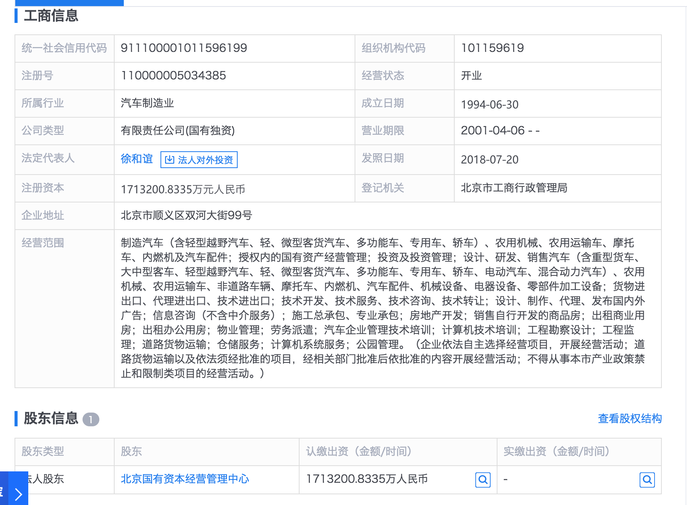
#### 6、广汽集团
```
全称：广州汽车工业集团有限公司
位置：广东省广州市
性质：有限责任公司(国有独资)	

子公司：广州汽车集团股份有限公司 等等
自主品牌：广汽传祺
合资品牌：广汽本田、广汽丰田、广汽菲亚特克莱斯勒等
```
广汽集团工商信息：
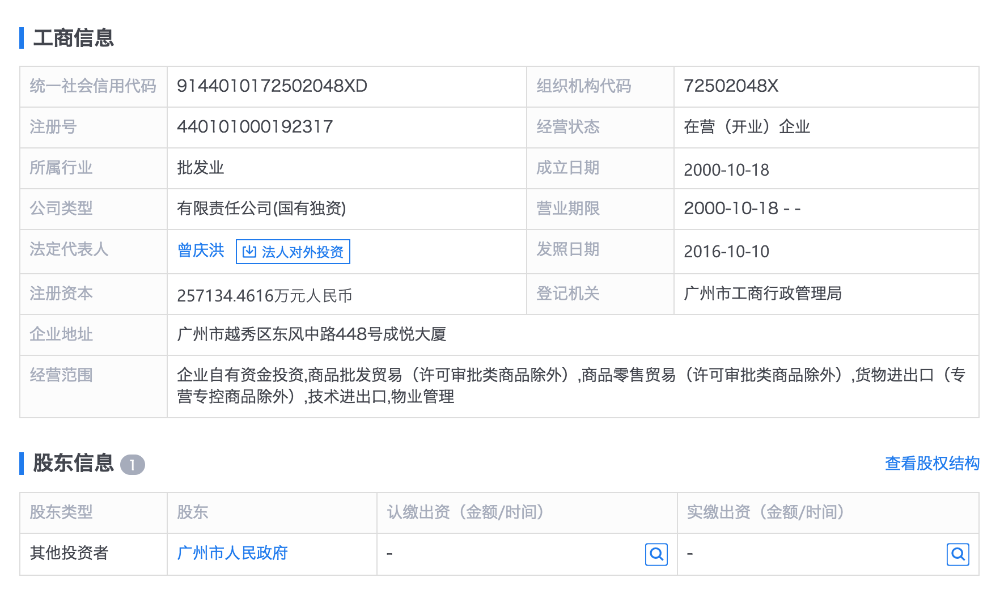
#### 7、奇瑞汽车
```
全称：奇瑞汽车股份有限公司
位置：安徽省芜湖市
性质：股份有限公司(非上市、国有控股)

自主品牌：
合资品牌：
```
奇瑞汽车工商信息：
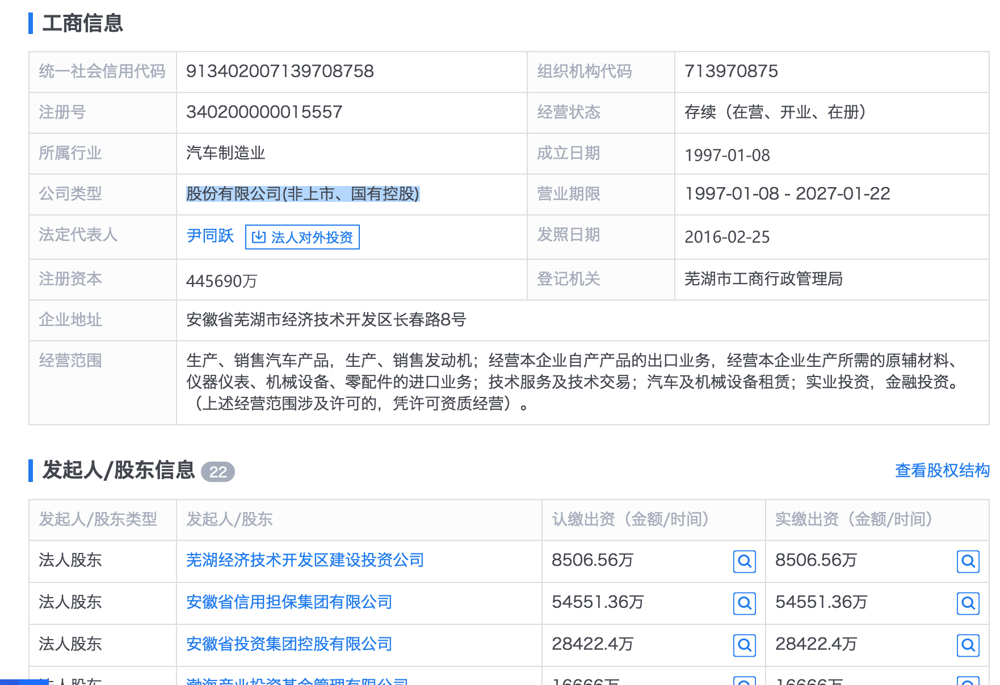
#### 8、吉利汽车
```
全称：浙江省吉利控股集团有限公司
位置：浙江杭州
性质：有限责任公司(自然人投资或控股)
自主品牌：
合资品牌：
```
吉利汽车工商信息：
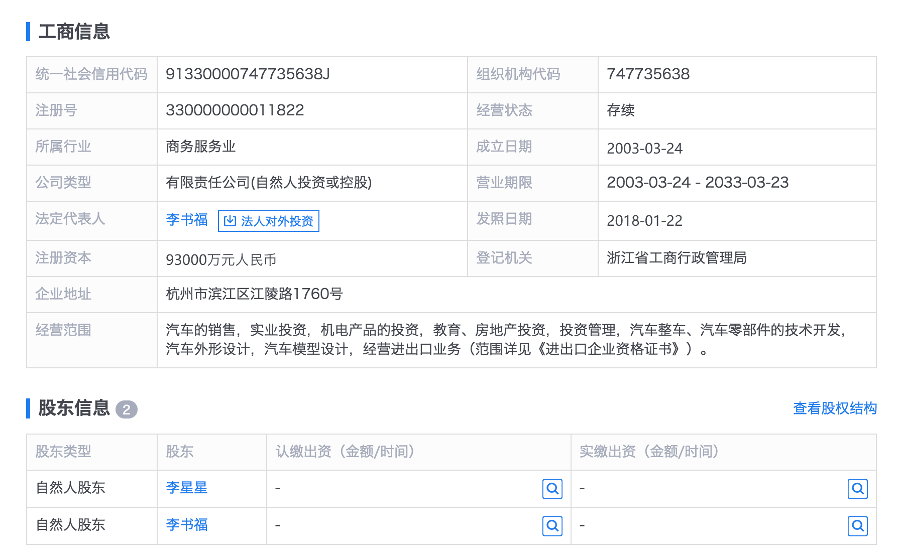
#### 9.比亚迪汽车
```
全称：比亚迪股份有限公司
位置：广东深圳
性质：股份有限公司(台港澳与境内合资、上市)
自主品牌：
合资品牌：
```
比亚迪汽车工商信息：
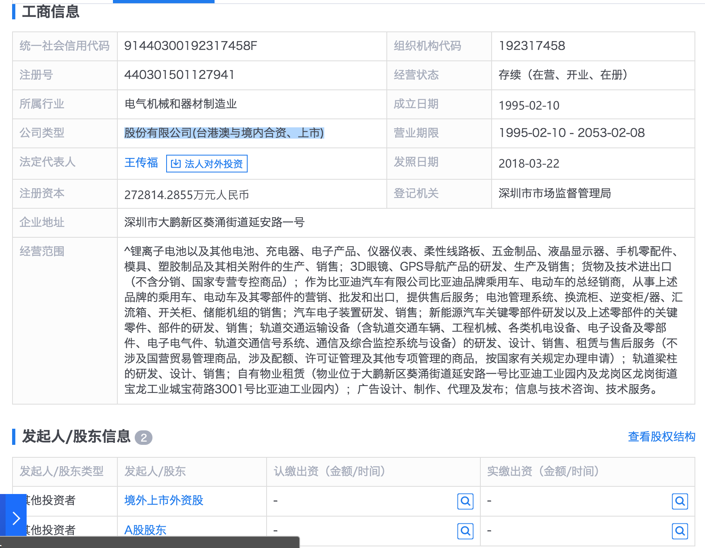
#### 10、长城汽车
```
全称：长城汽车股份有限公司
位置：河北保定
性质：股份有限公司(台港澳与境内合资、上市)
自主品牌：
合资品牌：
```
长城汽车工商信息：
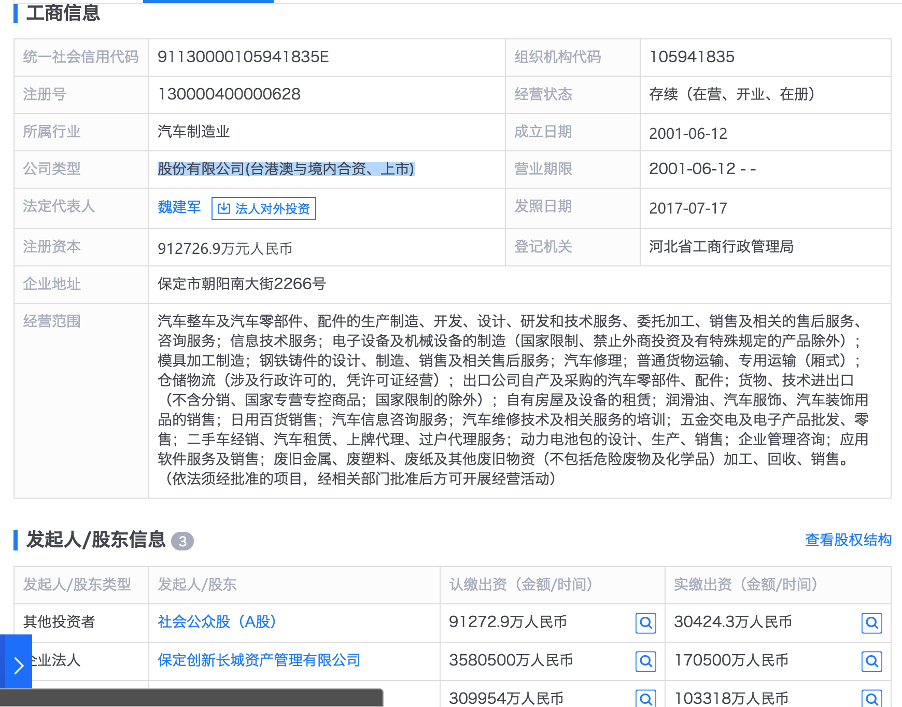

### 常见问题
#### 购车流程
```
```
#### 购车税费以及保险
```
```
#### 贴牌车
```
```
#### 其它
```
```
## 技术知识
### 发动机
```
```
### 变速箱
```
```
### 底盘系统
```
```
[referer](https://www.sohu.com/a/154943959_99942089)
## 购买注意事项